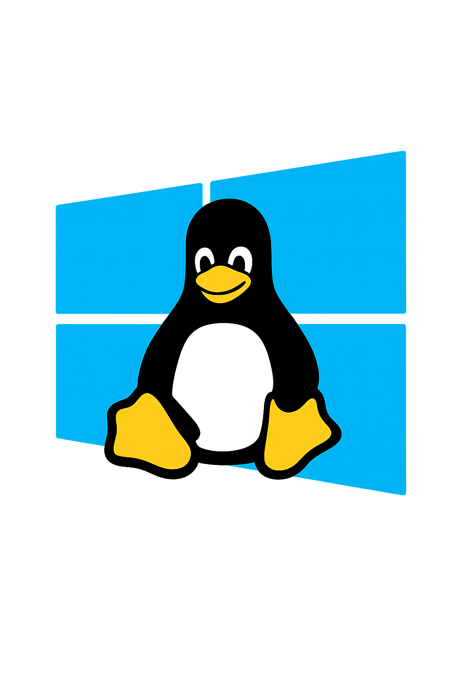

# LibOS
LibOS is a minimal library designed to expose typical OS-like features from a library, with a focus on desktop-related capabilities. The current target capability demonstrated by the project includes interacting with the X11 stack to obtain information such as the active window. The library is implemented in C++20 and is built as a static library.
What LibOS provides (summary)
- A portable API surface to access common OS/desktop features in a library form.
- Linux (X11) support for desktop inquiries like the active window.
- Cross-platform code paths (Windows, Linux) with build-time platform detection via CMake.
- A lightweight, dependency-conscious approach (no unit tests yet; extension-ready).

Note: The project is in an early stage. No unit tests are provided at this time.
## Features
- Get information about the active window on the desktop (Linux/X11 path).
- Clean separation of platform-specific implementations behind a common LibOS API.
- C++20, header-only-like interface with a small set of source files compiled into a static library.

## Architecture Overview
- include/LibOS
    - desktop
        - Base.hpp, Linux.hpp, Windows.hpp

    - WindowInfo.hpp

- src/LibOS
    - desktop
        - Base.cpp, Linux.cpp, Windows.cpp

    - library.cpp

- include/LibOS/LibOS.h
- CMakeLists.txt

Key behavior (Linux path)
- Linux path relies on an X11-based implementation to query the active window and related desktop information.
- The Linux code is compiled when CMake detects a UNIX-like platform with Linux as the system name.

## Dependencies
LibOS is designed to be lightweight and rely on libx11 for Linux/X11 functionality. The Windows path is separate and not dependent on X11.
- Core dependency (Linux): libx11
    - Other X11-related headers/libraries may be pulled in transitively (e.g., xcb headers) by libx11, depending on your system.

- Build tools: CMake, a C++20 capable compiler (GCC/Clang/MSVC), and a standard build toolchain.

## Installing dependencies on Arch Linux
Follow these steps to install the required dependencies and build LibOS on Arch Linux.
- Install X11 development headers and build tools:
    - sudo pacman -S --needed libx11 xorgproto libxcb
    - sudo pacman -S --needed cmake gcc clang make git

- Clone or prepare the LibOS repository, then build:
    - mkdir -p build && cd build
    - cmake -S .. -B .
    - cmake --build .
    - (Optional) cmake --build . --target install if you want to install the library system-wide (requires appropriate permissions).

Notes:
- The Arch package set for libx11 typically provides the necessary headers and libraries; the exact sub-packages may vary by distribution and version. The commands above ensure the common X11 development components are present.

## Build Instructions
- Prerequisites (Arch Linux example):
    - libx11, xorgproto, libxcb, cmake, a C++20 compiler, and git.

- Build steps:
    - mkdir -p build
    - cd build
    - cmake ..
    - cmake --build .

- The output will be a static library (LibOS.a) built from the sources in include/LibOS and src/LibOS.

If you’re integrating LibOS into another project, you can link against the produced static library and include include/LibOS for headers.
## How to Use
- Include the API header in your project:
    - #include "LibOS/LibOS.h"

- Call into the platform-abstracted API to retrieve information such as the active window:
    - This is demonstrated by the Linux/X11 path in the repository, which provides an implementation for obtaining the active window.

- Since the project is in an early stage, the public API is minimal and focused on desktop-related features. You can extend it as needed for other OS features.

Example (conceptual, not a full application)
- A consumer would include LibOS.h, link against LibOS.a, and call:
    - LibOS::GetActiveWindow()

- The underlying implementation uses a platform-specific path (Linux/Linux.cpp, Windows/Windows.cpp) selected at build time via CMake definitions.

## Testing
- There are no unit tests for LibOS yet. The project is in active development, and tests can be added as features stabilize.

## Contributing
- Feel free to open issues or submit pull requests with:
    - New platform support (Windows, macOS, etc.)
    - Additional desktop features (e.g., window management, desktop metrics)
    - Unit tests and CI integration

## Project Status
- Initial architecture in place.
- Linux/X11 path implemented; Windows path scaffolded.
- No unit tests yet.
- Dependencies outlined and build steps provided for Arch Linux.

If you’d like, I can tailor this README further to match your preferred project style, add a quick-start example program, or expand the API documentation with more detail on the LibOS.h API and the platform-specific implementations.

## License

Copyright (c) 2025 Johnny Mast <mastjohnny@gmail.com>

> Permission is hereby granted, free of charge, to any person obtaining a copy
> of this software and associated documentation files (the "Software"), to deal
> in the Software without restriction, including without limitation the rights
> to use, copy, modify, merge, publish, distribute, sublicense, and/or sell
> copies of the Software, and to permit persons to whom the Software is
> furnished to do so, subject to the following conditions:
>
> The above copyright notice and this permission notice shall be included in
> all copies or substantial portions of the Software.
>
> THE SOFTWARE IS PROVIDED "AS IS", WITHOUT WARRANTY OF ANY KIND, EXPRESS OR
> IMPLIED, INCLUDING BUT NOT LIMITED TO THE WARRANTIES OF MERCHANTABILITY,
> FITNESS FOR A PARTICULAR PURPOSE AND NONINFRINGEMENT. IN NO EVENT SHALL THE
> AUTHORS OR COPYRIGHT HOLDERS BE LIABLE FOR ANY CLAIM, DAMAGES OR OTHER
> LIABILITY, WHETHER IN AN ACTION OF CONTRACT, TORT OR OTHERWISE, ARISING FROM,
> OUT OF OR IN CONNECTION WITH THE SOFTWARE OR THE USE OR OTHER DEALINGS IN
> THE SOFTWARE.